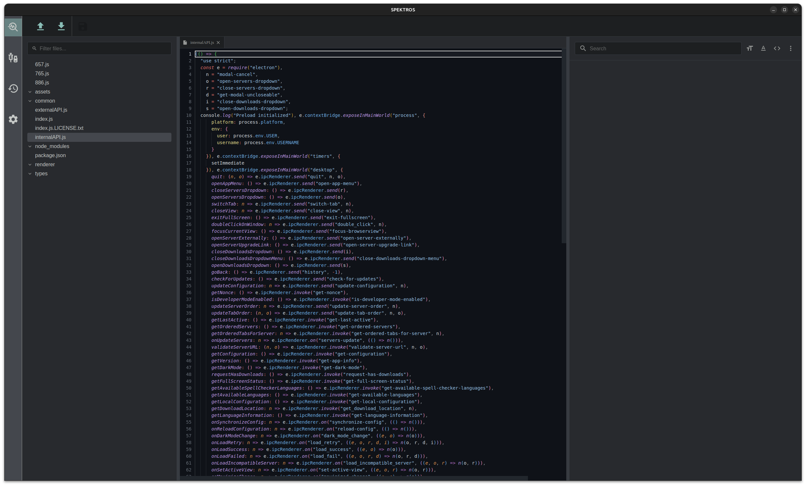
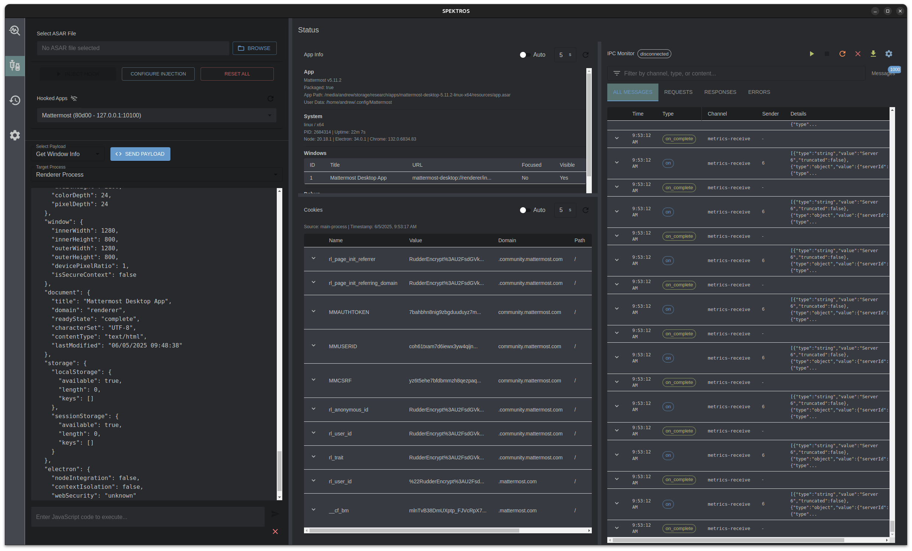

# Spektros

Spektros is a powerful security analysis and injection tool designed for Electron applications. It provides a modern, user-friendly interface for analyzing and manipulating Electron apps through various security-focused features. __This app still has a lot of bugs__. Mostly UI stuff that needs time to debug. Feel free to submit an issue or a PR. 

## Overview

Spektros consists of two main modules:

### Analysis Module


The Analysis module provides a comprehensive code analysis environment with:
- File tree navigation and code editing
- Syntax highlighting for multiple programming languages
- File content beautification
- Tab-based file management
- Advanced search and replace functionality
- Support for various file types including:
  - JavaScript/TypeScript
  - Python, Java, C/C++
  - Web technologies (HTML, CSS, SCSS)
  - Configuration files (JSON, YAML, TOML)
  - Documentation (Markdown, RST)

### Injector Module


The Injector module enables dynamic analysis and manipulation of running Electron applications:
- ASAR file injection capabilities
- Real-time process monitoring
- Custom payload injection
- Debug port configuration
- Call-home functionality
- Terminal integration
- Process information gathering
- IPC monitoring
- Cookie management
- App information display

## Getting Started

### Prerequisites
- Node.js (Latest LTS version recommended)
- npm or yarn package manager

### Installation
1. Clone the repository
2. Install dependencies:
```bash
npm install
# or
yarn install
```

### Running the Application
```bash
npm start
# or
yarn start
```

## Usage Guide

### Analysis Module
1. Load an ASAR file using the file browser
2. Navigate the file tree to locate files of interest
3. Use the search functionality to find specific code patterns
4. Edit files directly in the built-in code editor
5. Use the beautify feature to format code
6. Save changes and repack the ASAR file when ready

### Injector Module
1. Select an ASAR file for injection
2. Configure injection parameters (debug port, call-home settings)
3. Inject the hook into the target application
4. Monitor connected applications
5. Use the terminal to execute custom payloads
6. Monitor IPC communication and cookies
7. View detailed application information

## Technical Features

- Modern React-based UI with Material-UI components
- Real-time theme switching with smooth transitions
- Persistent settings storage
- File system integration
- Process management
- IPC communication monitoring
- Terminal integration
- Custom payload system

## Security Note

This tool is designed for security analysis and testing purposes. Always ensure you have proper authorization before using it on any application.

